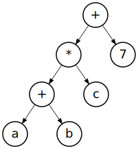

# Expression

An expression is a combination of variables, primitives, operators and functions
that are evaluated to get their value. The evaluation is done in a specific
order.

## Order of operations

The order of operations is used when evaluating an expression to determine
which procedure to perform first. This impacts the result of an expression.
A simple example is `1 + 2 * 3` versus `(1 + 2) * 3` . Both expressions have a
different result because the order of operations prioritizes parentheses.

| N. | Operation token      | Context                                   |
|----|----------------------|-------------------------------------------|
| 1  | ( expression )       | Parentheses                               |
| 2  | name()               | Function call                             |
| 3  | - + !                | Unary operators                           |
| 4  | **                   | Involution                                |
| 5  | * / %                | Multiplication, division, modulo          |
| 6  | + -                  | Addition and subtraction                  |
| 7  | == != <= >= < >      | Comparisons                               |
| 8  | &&                   | Logical AND                               |
| 9  | \|\|                 | Logical OR                                |
| 10 | = += -= *= /= %= **= | Assignment operators                      |
| 11 | 1, true, name        | Identifier & Literal  (terms)             |

<sub>This list is still in concept and will subject to change</sub>  
<sub>See [operators](operators.md) for details about the operators.</sub>

### EBNF Notation

```ebnf
expression =
  identifier_expression |
  literal_expression |
  binary_expression |
  unary_expression |
  grouping_expression |
  assignment_expression ;
```

## Identifier expression

Identifiers are references to the name of a variable declared inside of a scope.
These share a spot in the order of operations with literals under the combined
name "terms". Identifier expressions cannot exist on their own and are always
nested within other expressions.

### EBNF Notation

```ebnf
identifier_expression = name;
```

### Example

```ttr
var foo = 12
foo = 2

// "foo" is the identifier expression nested in the assignment expression "foo = 2".

val bar = foo / 7

// "foo" and "bar" are both identifier expressions nested within an expression tree.
```

## Literal expression

Literals are expressions based on a single item, similar to identifiers. A
literal value is a primitive like: `1`, `true`, `false`, or a `'string'`.
Literals share a spot in the order of operations with identifiers under the
combined name "terms". Like identifiers, these cannot exist on their own and
are always nested within another expression.

### EBNF Notation

```ebnf
literal_expression = boolean | integer | string ;
```

<sub>See [primitives](primitives.md) for details about primitives.</sub>

### Example

```ttr
var foo = 12
foo = 2

// 12 and 2 are both literal expressions.

val bar = foo / 7

// 7 is a literal expression.

var baz = true
baz = false

// true and false are both literal expressions.

var quux = 'Niels'
quux = 'Marnix'

// 'Niels' and 'Marnix' are both literal expressions.
```

## Binary expression

Used in performing an operation on two expressions. These are used to build the
expression tree. The last leaf within the tree will always be a term
(identifier or literal). Binary expressions are used for mathematical
operations, logic operations, assignment expressions and any valid combination
between these. Binary expressions follow the
[order of operations](#order-of-operations).

Binary expressions consist of a left- and right-side expression. For lines
containing multiple operations a binary expression tree is build which can go
to a very deep nesting of expressions.

Expression: (a + b) * c + 7



<sub>Expression tree - from
[Wikimedia](https://commons.wikimedia.org/wiki/File:Exp-tree-ex-11.svg)</sub>

More information about expression trees and their working can be found on the
[Wikipedia article](https://en.wikipedia.org/wiki/Binary_expression_tree) on
binary expression trees.

### EBNF Notation

```ebnf
binary_expression = expression , operator , expression ;
```

<sub>See [operators](operators.md) for details on operators.</sub>

### Example

```ttr
val foo = 2 * 3

// "2 * 3" is a binary expression of 2 terms with a multiply operation.

val bar = foo / 1

// "foo / 1" is a binary expression of 2 terms with a division operation.

val baz = foo * bar + 12 / 2

// "foo * bar + 12 / 2" is a binary expression tree root. Both the left and right side contain another binary expression.
// The left side is "foo * bar" and the right is "12 / 2". Evaluating this will result in 42.
```

## Unary expression

Used to apply a single operator to an expression like using a minus operator to
invert the state of an mathematical expression.

### EBNF Notation

```ebnf
unary_expression = ( minus | plus ) , expression ;
```

### Example

```ttr
var foo = 12
foo = -foo

// "-foo" is an unary expression that inverts the state of literal to a negative number.
```

## Grouping expression

A grouping is used for telling the interpreter to resolve the grouped expression
before others. This is helpful when resolving a nested expression with an higher
order of operation before one with an lower order. Using the grouping expression
to change the order of operations also change the outcome. A classic example of
this is [PEMDAS](https://pemdas.info) for basic mathematical expressions.

### EBNF Notation

```ebnf
grouping_expression = "(" , expression , ")" ;
```

### Example

```ttr
// Using the normal order of operations
// "5 * 2" is evaluated before "1 + ".

1 + 5 * 2 // = 11

// Using the grouping expression
// "(1 + 5)" is evaluated before "* 2".

(1 + 5) * 2 // = 12
```

## Assignment expression

Used for binding a result of an expression to a variable. This can be used in
declarations and as an expression. It consists of the name of the variable that
will bind the expression result, the type of assignment and a expression to
evaluate. The expression is evaluated and assigned to the variable using the
given operator type.

### EBNF Notation

```ebnf
assignment_expression = name , assignment_operator , expression ;
```

### Example

```ttr
var foo = 1
foo = 2

// foo = 2

var bar = 12
bar += 4

// bar = 16

var baz = 9
baz /= 3

// baz = 3

var qux = 2
qux **= 8

// qux = 256
```

<sub>See [variables](variables.md) for details about variables.</sub>  
<sub>See [operators](operators.md) for details about operators.</sub>
